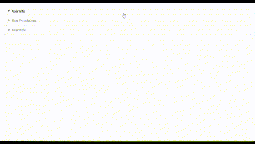

# High-Level FSD Assignment

This project is a high-level Full Stack Development (FSD) assignment, aiming to provide a foundation for building a web application with user-related functionalities. The project includes components for managing user information, permissions, and roles.



## Project Structure

The project is organized into the following components:

### User

The `User` component serves as the main container for managing user-related pages and features.

#### User Pages:

1. **UserInfoPage:**

   - Displays user profile information.
   - Includes a form for editing user details.

2. **UserPermissionsPage:**

   - Manages user permissions through toggle buttons.
   - Allows users to control access to various modules.

3. **UserRolePage:**
   - Provides information about the user's role.
   - Includes features for managing and updating the user's role.

### Accordion

The `Accordion` component is a custom implementation for displaying collapsible sections. It is used to organize and present the different user-related pages within the `User` component.

## Usage

To use this project, follow these steps:

1. **Clone the Repository:**

   ```bash
   git clone git@github.com:surshreya/high-level-fsd-assignment.git
   ```

2. **Navigate to the Project Directory:**

   ```bash
   cd high-level-fsd-assignment
   ```

3. **Install Dependencies:**

   ```bash
   npm install
   ```

4. **Run the Application:**

   ```bash
   npm start
   ```
